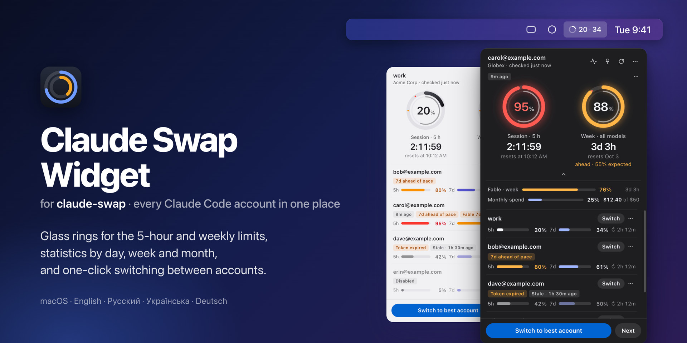
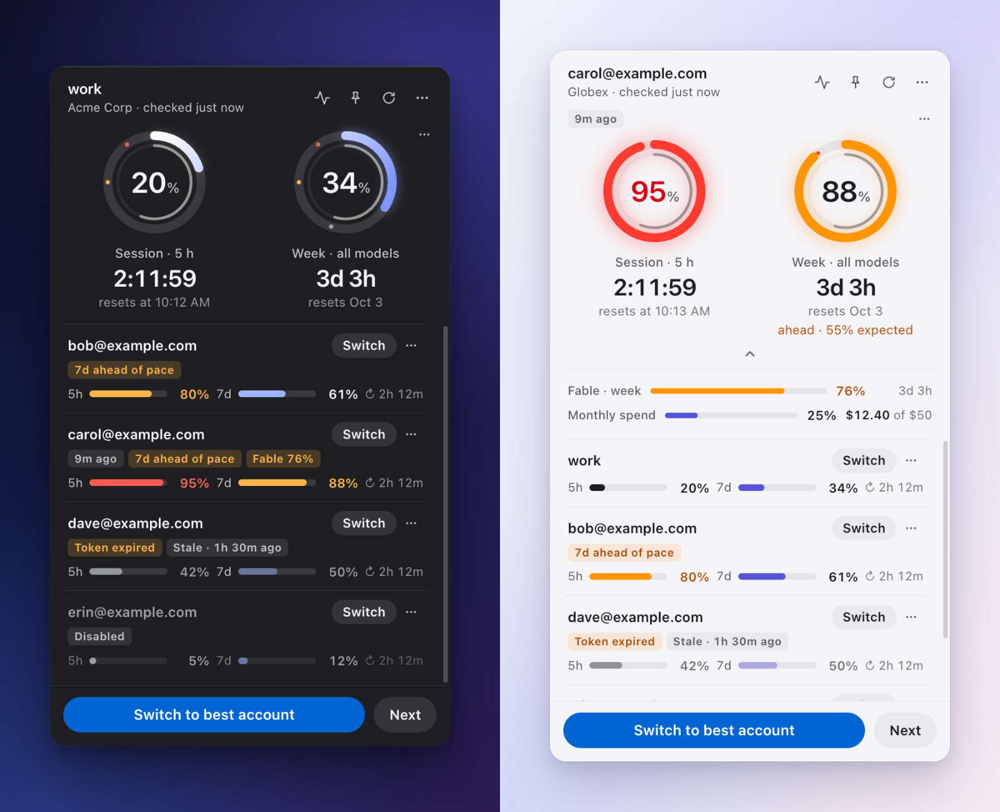
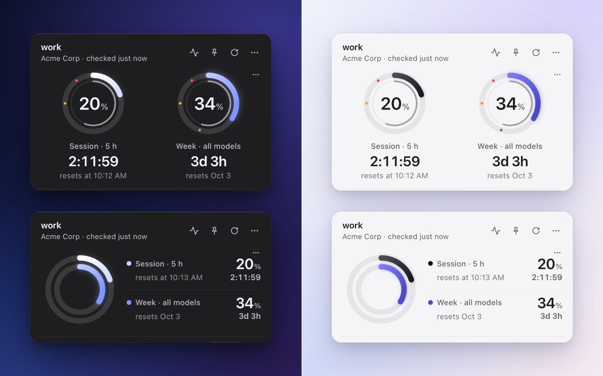
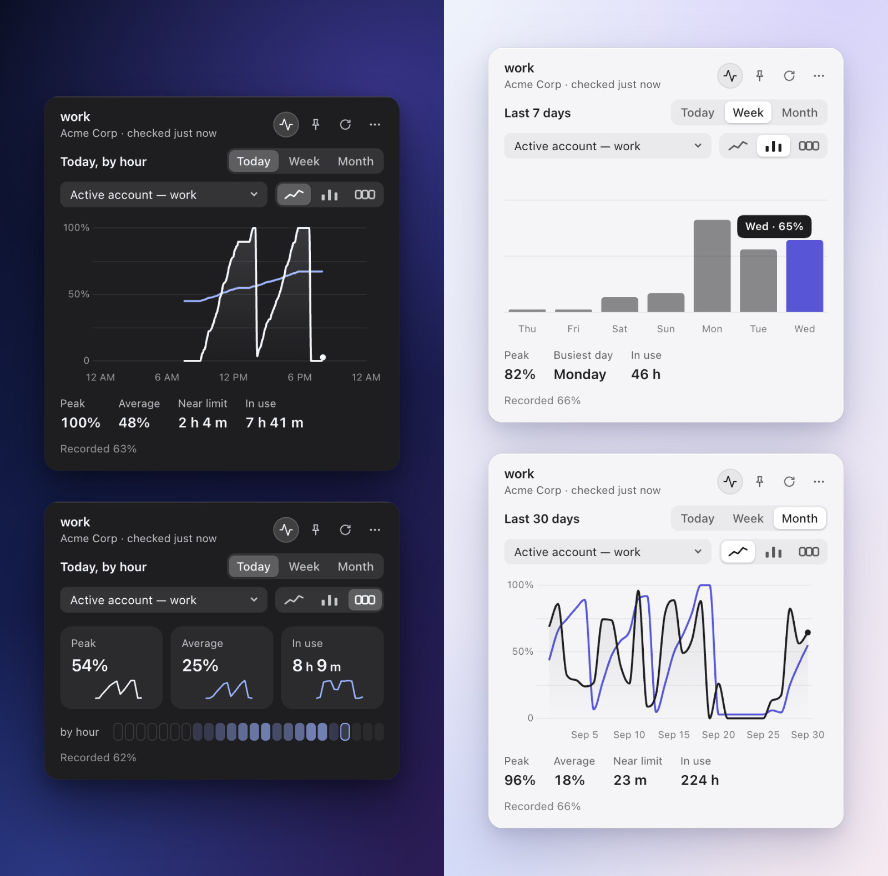
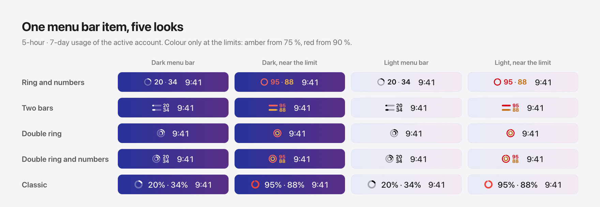
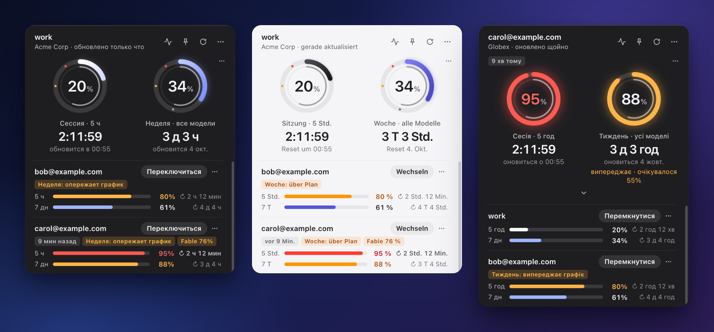
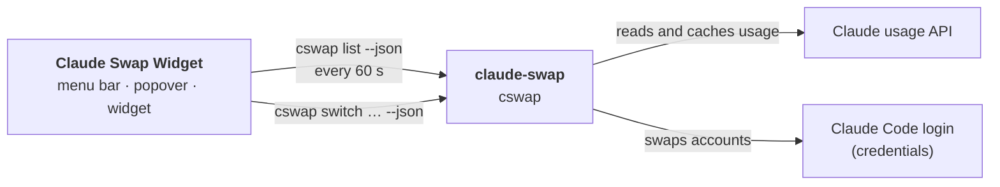

<p align="center">
  
</p>

<p align="center">
  <a href="https://github.com/Btvmn/claude-swap-widget/releases/latest"></a>
  
  <a href="https://github.com/realiti4/claude-swap"></a>
  
  <a href="LICENSE"></a>
</p>

<p align="center">
  <a href="#install"><b>Install</b></a> ·
  <a href="#features"><b>Features</b></a> ·
  <a href="#how-it-works"><b>How it works</b></a> ·
  <a href="#settings-and-troubleshooting"><b>Troubleshooting</b></a> ·
  <a href="#credits"><b>Credits</b></a>
</p>

**Claude Swap Widget** lives in the macOS menu bar. It shows how much of the
5-hour and weekly limits is left on every Claude Code account you manage with
[claude-swap](https://github.com/realiti4/claude-swap), and switches between
them with one click.

It is a small UI **on top of** claude-swap, not a fork of it. Every account
operation goes through the `cswap` command line tool, and the widget never
reads or writes your credentials itself.

## Features

### Every account at a glance

<p align="center">
  
</p>

- The **active account** in two large rings: the 5-hour session and the
  7-day week, each with threshold marks, a live countdown and the reset time.
  The week ring marks where an even pace would be and tells you when you are
  ahead of it. Per-model weekly limits and extra-usage spend unfold under the
  rings.
- **Every other account** as a row with two thin bars (5h, 7d), the time to
  its reset and badges: **Disabled**, **Token expired**, **Re-login**,
  **Stale**, **9m ago** for an older measurement, **7d ahead of pace**.
- **Switch** on each row, a **⋯** menu (switch, in rotation on/off,
  statistics, copy email, remove), and **Switch to best account**
  (`cswap switch --strategy best`) and **Next** at the bottom.
- Amber from 75 %, red from 90 %. Light and dark follow the system, or pick
  one.

### Two looks for the rings

<p align="center">
  
</p>

Two rings side by side, or one inside the other with the numbers next to
it: **Settings → Rings**.

### Statistics

<p align="center">
  
</p>

The graph button opens **Today**, **Week** or **Month** for any account, as a
line, bars or summary cards: peak, average, time near the limit, time in use
and spend. The history stays on this Mac for 32 days (see [Privacy](#privacy)).

### Menu bar

<p align="center">
  
</p>

The active account's 5-hour · 7-day usage, in one of five styles
(**Settings → Menu Bar → Style**). It stays monochrome like any other menu bar
item and takes colour only near the limits. A `?` means the data could not be
refreshed or is only the last good measurement; `–` means the window has just
reset and new data has not arrived yet.

### Your language

<p align="center">
  
</p>

English, Русский, Українська and Deutsch. The app follows the system
language, or you choose one in **Settings → Language**.

### And also

- 📌 **Desktop widget.** The pin button keeps the window on the desktop.
  Click it again to return to the menu bar popover.
- 🔔 **Notifications** when the active account reaches 75 % and 90 % of a
  window, when it is used up, and when it is available again.
- 🖱️ **Right-click menu** on the menu bar item (also the popover's **⋯**):
  all accounts with their usage (click to switch), Switch to Next / Best /
  Next Available, Disable / Enable Account, Add and Remove Account (shows the
  `cswap` command to run), Open cswap Log, Statistics, and every setting.
- ⌨️ <kbd>Esc</kbd> closes the popover, <kbd>⌘R</kbd> refreshes.

## Requirements

- macOS on Apple Silicon. Other platforms may work but are not tested.
- [claude-swap](https://github.com/realiti4/claude-swap) **0.20 or newer**
  (tested with 0.26.0 and 0.27.0b1), which needs Python 3.12 or newer.
- At least one Claude Code account added to claude-swap.

## Install

**1. Install claude-swap and add your accounts.**

```sh
uv tool install claude-swap      # or: pipx install claude-swap
```

Then, for each account: log in to Claude Code with it, and run

```sh
cswap add
```

`cswap list` should now show all of them. See the
[claude-swap README](https://github.com/realiti4/claude-swap) for details.

**2. Install the widget.** Download the `.dmg` from
[Releases](https://github.com/Btvmn/claude-swap-widget/releases/latest), open
it and drag **Claude Swap Widget** to Applications.

**3. Open it the first time.** The app is not notarized by Apple, so macOS
blocks it once.

<details>
<summary><b>How to open an app macOS has blocked</b></summary>

1. Open the app once. macOS says it cannot be opened. Click **Done**.
2. Open **System Settings → Privacy & Security**, scroll down, and click
   **Open Anyway** next to "Claude Swap Widget was blocked".
3. Confirm with **Open**.

Or remove the quarantine flag in Terminal instead:

```sh
xattr -dr com.apple.quarantine "/Applications/Claude Swap Widget.app"
```

</details>

The app has no Dock icon. Look for the ring in the menu bar. To start it with
your Mac, use **Open at Login** in its right-click menu.

## How it works



The widget runs `cswap list --json` every 60 seconds (and when you open the
popover), and `cswap switch … --json` when you click Switch. That is all it
does. claude-swap does the real work: it reads usage, caches it, refreshes
tokens and swaps credentials. It also holds the locks that keep Claude Code
safe while it does.

- The widget itself makes no network requests and stores no credentials.
- Switching never logs you out. Claude Code picks up the new account on its
  next request.
- The widget never cuts claude-swap off in the middle of a switch or a token
  refresh. Its timeouts are only there for a process that hangs.

## Privacy

Usage history for the statistics is kept on this Mac only, in
`~/Library/Application Support/Claude Swap Widget/history/`, for 32 days. It
stores percentages, spend, and each account's email, alias and organisation
name — never tokens or credentials. Turn it off with **Settings → Keep Usage
History**, or delete it with **Settings → Clear Usage History…**, in the
right-click menu.

## Settings and troubleshooting

Everything is set from the right-click menu: language, appearance, menu bar
style and percentage, ring look, 12/24-hour time, weekly reset date format,
refresh interval, notifications, usage history, popover or desktop widget,
Open at Login, and the cswap binary.

<details>
<summary><b>"Install claude-swap"</b>: the widget did not find <code>cswap</code></summary>

Apps started from Finder do not see your shell's `PATH`, so the widget looks
in `PATH`, `~/.local/bin`, `/opt/homebrew/bin` and `/usr/local/bin`. If yours
is elsewhere, use **Choose binary…**. You can also set the `CSWAP_PATH`
environment variable.

</details>

<details>
<summary><b>"Update claude-swap"</b>: your claude-swap is older than 0.20</summary>

Run `uv tool upgrade claude-swap` or `pipx upgrade claude-swap`.

</details>

<details>
<summary><b>"No accounts yet"</b></summary>

Add an account with `cswap add` (see [Install](#install)), then click
**Check again**.

</details>

<details>
<summary><b>You use <code>CLAUDE_CONFIG_DIR</code></b></summary>

If you point Claude Code at a non-default config directory in your shell
profile, an app started from Finder does not see that variable, so
claude-swap uses `~/.claude`. Make the variable visible to GUI apps as well,
then restart the widget:

```sh
launchctl setenv CLAUDE_CONFIG_DIR "$HOME/path/to/your/config"
```

</details>

<details>
<summary><b>The settings file</b></summary>

Settings live in
`~/Library/Application Support/Claude Swap Widget/settings.json`, for example:

```json
{
  "cswapPath": null,
  "theme": "system",
  "language": "system",
  "trayStyle": "ring",
  "gaugeStyle": "rings",
  "refreshSeconds": 60,
  "notifications": true,
  "recordHistory": true,
  "windowMode": "popover"
}
```

Unknown or invalid values fall back to their defaults; `refreshSeconds` is
clamped to between 30 seconds and one day.

</details>

## Development

```sh
npm install
npm test                 # unit tests (node --test)
npm start                # runs against your real cswap
```

To work on the UI without touching your real accounts, use the fake `cswap`
in `test/fixtures`. It speaks the same JSON and keeps its "active account" in
a temp file:

```sh
CSWAP_PATH="$PWD/test/fixtures/fake-cswap" npm start
FAKE_CSWAP_SCENARIO=empty CSWAP_PATH="$PWD/test/fixtures/fake-cswap" npm start
```

Scenarios: `default`, `empty`, `root`, `garbage`, `slow`, `stubborn`,
`schema2`, `old`, `flood`, `crash`, `rolled`. `CSW_THEME=light|dark` forces
the theme. `CSW_CAPTURE=out.png` saves a screenshot of the popover and quits.
Every picture in this README was made this way, from the fake accounts.

Build the `.dmg` (Apple Silicon, ad-hoc signed):

```sh
npm run dist             # → dist/Claude Swap Widget-<version>-arm64.dmg
```

`npm run icon` redraws `build/icon.png`.

## Credits

- [claude-swap](https://github.com/realiti4/claude-swap) by Onur Cetinkol
  (MIT) does all the account work. This widget is only a front end for it.
- The look — glass rings, menu bar pictures, statistics and the refresh
  animation — as well as the usage notifications and the English, Russian,
  Ukrainian and German translations come from
  [Claude Usage Widget — *The* Maestro edition](https://github.com/TheMaestr-o/claude-usage-widget)
  by [The Maestro](https://github.com/TheMaestr-o), itself based on
  [Claude Usage Widget](https://github.com/SlavomirDurej/claude-usage-widget)
  by Slavomir Durej. Both are MIT licensed (see [LICENSE](LICENSE)). Its
  data layer (claude.ai login, session cookie) is not used: every number
  comes from claude-swap.
- Charts: [Chart.js](https://www.chartjs.org) (MIT), bundled in
  `src/renderer/vendor/`.

Not affiliated with or endorsed by Anthropic. Claude and Claude Code are
trademarks of Anthropic.

## License

[MIT](LICENSE)
