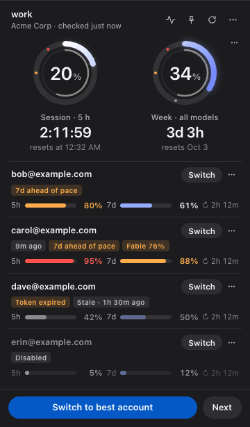
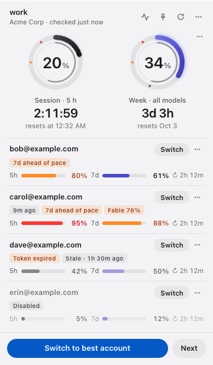
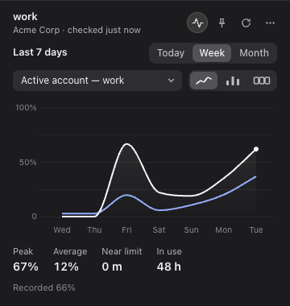

# claude-swap-widget

A macOS menu-bar widget that shows the usage of every Claude Code account you
manage with [claude-swap](https://github.com/realiti4/claude-swap), and
switches between them with one click.

<p>
  
  
  
</p>

It is a small UI **on top of** claude-swap, not a fork of it: every account
operation goes through the `cswap` command line tool, and the widget never
reads or writes your credentials itself.

## What it shows

- **Menu bar:** the active account's usage next to a ring, in one of five
  styles (Settings ▸ Menu Bar ▸ Style): ring and numbers `20 · 34` (5-hour ·
  7-day, the default), two bars, a double ring, a double ring with numbers, or
  the classic single ring and one percentage. Amber from 75 %, red from 90 %.
  A `?` means the data could not be refreshed or is only the last good
  measurement; `–` means the window has just reset and new data has not
  arrived yet.
- **Popover** (click the menu-bar icon):
  - the **active account** in two large rings, the 5-hour session and the
    7-day week, with threshold marks, a live countdown to each reset and the
    reset time. The week ring marks where an even pace would be and says when
    you are ahead of it. Per-model weekly limits and extra-usage spend unfold
    under the rings. A second look puts one ring inside the other
    (Settings ▸ Rings);
  - **every other account** as a row with two thin bars (5h, 7d), the time to
    its reset, badges (**Disabled**, **Token expired**, **Re-login**,
    **Stale**, **9m ago** for an older measurement, **7d ahead of pace**), a
    **Switch** button and a **⋯** menu (switch, in rotation on/off,
    statistics, copy email, remove);
  - **Switch to best account** (`cswap switch --strategy best`) and **Next**
    at the bottom;
  - **Statistics** (the graph button): Today / Week / Month for any account,
    as a line, bars or summary cards — peak, average, time near the limit,
    time in use and spend. History is kept on this Mac for 32 days;
  - the **pin** button keeps the window on the desktop as a widget; click it
    again to return to the menu-bar popover.
- **Right-click menu** (also the popover's **⋯**): all accounts with their
  usage (click to switch), Switch to Next / Best / Next Available,
  Disable / Enable Account, Add and Remove Account (shows the `cswap` command to
  run), Open cswap Log, Statistics, and Settings: language (English, Русский,
  Українська, Deutsch), appearance, menu-bar style and percentage, ring look,
  12/24-hour time, weekly reset date format, refresh interval,
  notifications, usage history, popover or desktop widget, Open at Login,
  and the cswap binary.
- **Notifications** when the active account reaches 75 % and 90 % of a
  window, when it is used up, and when it is available again.

Press <kbd>Esc</kbd> to close the popover, <kbd>⌘R</kbd> to refresh.

## Requirements

- macOS on Apple Silicon. Other platforms may work but are not tested.
- [claude-swap](https://github.com/realiti4/claude-swap) **0.20 or newer**
  (tested with 0.26.0 and 0.27.0b1), which needs Python 3.12 or newer.
- At least one Claude Code account added to claude-swap.

## Install

### 1. Install claude-swap and add your accounts

```sh
uv tool install claude-swap      # or: pipx install claude-swap
```

Then, for each account: log in to Claude Code with it, and run

```sh
cswap add
```

`cswap list` should now show all of them. See the
[claude-swap README](https://github.com/realiti4/claude-swap) for details.

### 2. Install the widget

Download the `.dmg` from
[Releases](https://github.com/Btvmn/claude-swap-widget/releases), open it and
drag **Claude Swap Widget** to Applications.

The app is not notarized by Apple, so macOS blocks it the first time. To open it:

1. Open the app once. macOS says it cannot be opened. Click **Done**.
2. Open **System Settings → Privacy & Security**, scroll down, and click
   **Open Anyway** next to "Claude Swap Widget was blocked".
3. Confirm with **Open**.

Or remove the quarantine flag in Terminal instead:

```sh
xattr -dr com.apple.quarantine "/Applications/Claude Swap Widget.app"
```

The app has no Dock icon. Look for the ring in the menu bar. To start it with
your Mac, use **Open at Login** in its right-click menu.

## How it works

The widget runs `cswap list --json` every 60 seconds (and when you open the
popover), and `cswap switch … --json` when you click Switch. That is all it
does. claude-swap does the real work: it reads usage, caches it, refreshes
tokens and swaps credentials. It also holds the locks that keep Claude Code
safe while it does.

- The widget itself makes no network requests and stores no credentials.
- Switching never logs you out. Claude Code picks up the new account on its
  next request.
- The widget never cuts claude-swap off in the middle of a switch or a token
  refresh. Its timeouts are only there for a process that hangs.

## Settings and troubleshooting

**"Install claude-swap"**: the widget did not find `cswap`. Apps started from
Finder do not see your shell's `PATH`, so the widget looks in `PATH`,
`~/.local/bin`, `/opt/homebrew/bin` and `/usr/local/bin`. If yours is
elsewhere, use **Choose binary…**. You can also set the `CSWAP_PATH`
environment variable.

**"Update claude-swap"**: run `uv tool upgrade claude-swap` or
`pipx upgrade claude-swap`.

**"No accounts yet"**: add an account with `cswap add` (see above), then
click **Check again**.

**`CLAUDE_CONFIG_DIR`**: if you point Claude Code at a non-default config
directory in your shell profile, an app started from Finder does not see that
variable, so claude-swap uses `~/.claude`. Make the variable visible to GUI
apps as well, then restart the widget:

```sh
launchctl setenv CLAUDE_CONFIG_DIR "$HOME/path/to/your/config"
```

Settings are changed from the right-click menu and live in
`~/Library/Application Support/Claude Swap Widget/settings.json`, for example:

```json
{
  "cswapPath": null,
  "theme": "system",
  "language": "system",
  "trayStyle": "ring",
  "gaugeStyle": "rings",
  "refreshSeconds": 60,
  "notifications": true,
  "recordHistory": true,
  "windowMode": "popover"
}
```

Unknown or invalid values fall back to their defaults; `refreshSeconds` is
clamped to between 30 seconds and one day.

## Development

```sh
npm install
npm test                 # unit tests (node --test)
npm start                # runs against your real cswap
```

To work on the UI without touching your real accounts, use the fake `cswap`
in `test/fixtures`. It speaks the same JSON and keeps its "active account" in
a temp file:

```sh
CSWAP_PATH="$PWD/test/fixtures/fake-cswap" npm start
FAKE_CSWAP_SCENARIO=empty CSWAP_PATH="$PWD/test/fixtures/fake-cswap" npm start
```

Scenarios: `default`, `empty`, `root`, `garbage`, `slow`, `stubborn`,
`schema2`, `old`, `flood`, `crash`, `rolled`. `CSW_THEME=light|dark` forces
the theme. `CSW_CAPTURE=out.png` saves a screenshot of the popover and quits.

Build the `.dmg` (Apple Silicon, ad-hoc signed):

```sh
npm run dist             # → dist/Claude Swap Widget-<version>-arm64.dmg
```

`npm run icon` redraws `build/icon.png`.

## Privacy

Usage history for the statistics is kept on this Mac only, in
`~/Library/Application Support/Claude Swap Widget/history/`, for 32 days. It
stores percentages, spend, and each account's email, alias and organisation
name — never tokens or credentials. Turn it off with **Settings → Keep Usage
History**, or delete it with **Settings → Clear Usage History…**, in the
right-click menu.

## Credits

- [claude-swap](https://github.com/realiti4/claude-swap) by Onur Cetinkol
  (MIT) does all the account work. This widget is only a front end for it.
- The look — glass rings, menu bar pictures, statistics and the refresh
  animation — as well as the usage notifications and the English, Russian,
  Ukrainian and German translations come from
  [Claude Usage Widget — *The* Maestro edition](https://github.com/TheMaestr-o/claude-usage-widget)
  by [The Maestro](https://github.com/TheMaestr-o), itself based on
  [Claude Usage Widget](https://github.com/SlavomirDurej/claude-usage-widget)
  by Slavomir Durej. Both are MIT licensed; the code is used with the
  author's permission (see [LICENSE](LICENSE)). Its data layer (claude.ai
  login, session cookie) is not used: every number comes from claude-swap.
- Charts: [Chart.js](https://www.chartjs.org) (MIT), bundled in
  `src/renderer/vendor/`.

Not affiliated with or endorsed by Anthropic. Claude and Claude Code are
trademarks of Anthropic.

## License

[MIT](LICENSE)
